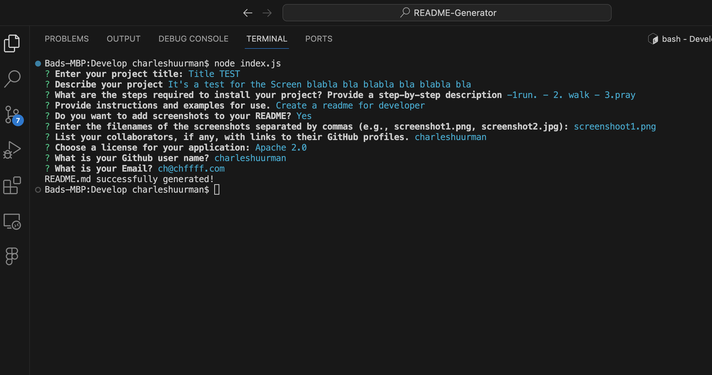
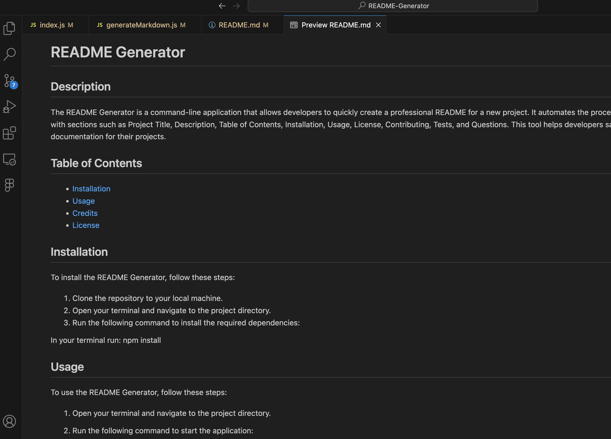

# README Generator

## Description

The README Generator is a command-line application that allows developers to quickly create a professional README for a new project. It automates the process of generating a README file with sections such as Project Title, Description, Table of Contents, Installation, Usage, License, Contributing, Tests, and Questions. This tool helps developers save time and ensures consistent documentation for their projects.

## Table of Contents

- [Installation](#installation)
- [Usage](#usage)
- [Credits](#credits)
- [Tests](#tests)
- [License](#license)

## Installation

To install the README Generator, follow these steps:

1. Clone the repository from: [GitHub repository](https://github.com/charleshuurman/README-Generator)  to your local machine.
2. Open your terminal and navigate to the project directory.
3. Run the following command to install the required dependencies:

In your terminal run: npm install

## Usage

To use the README Generator, follow these steps:

1. Open your terminal and navigate to the project directory.

2. Run the following command to start the application:

    In your terminal run: node index.js

3. Answer the prompts to provide information about your project, such as the title, description, installation instructions, usage, and more.

4. If you choose to add screenshots, make sure to place the screenshot files in the `screenshots` directory within the project folder. Enter the filenames when prompted.

5. Once you've answered all the prompts, the README.md file will be generated in the project's root directory.

6. You can customize the generated README further if needed.

Here you can see an example video: [Youtube video example](https://youtu.be/CY3Y-JaFjg4)

## Credits

- This project was created by [Charles Huurman] - [GitHub Profile](https://github.com/charleshuurman)

## Tests
Several tests were made like this one: [Youtube video example](https://youtu.be/CY3Y-JaFjg4)

## License

This project is licensed under the [MIT License](LICENSE).

